# 🛠️ LAM Development Guide

Welcome to the LAM (LLM API-key Manager) development guide! This document will help you understand the project architecture, contribute effectively, and maintain the high-quality standards of this security-focused tool.

## 🎯 Quick Start for Contributors

### 🚀 Getting Started

```bash
# Fork and clone the repository
git clone https://github.com/Ahzyuan/LLM-Apikey-Manager.git
cd LLM-Apikey-Manager

# Install development dependencies
sudo apt-get install shellcheck bats jq

# Set up development environment
./install.sh  # Install LAM locally for testing

# Run code quality checks
shellcheck lam lib/*.sh lib/commands/*.sh
```

### 🧪 Testing Your Changes

```bash
# Test basic functionality
lam init
lam add test-profile
lam list
lam backup create test-backup

# Write tests
bats test/feat_xxx_test.sh
```

## 🏗️ Architecture Overview

### Project Structure
```
lam/
├── lam                    # Main executable script
├── install.sh             # Installation script
├── lib/                   # Library modules
│   ├── config.sh          # SQLite database management
│   ├── security.sh        # Encryption and authentication
│   ├── utils.sh           # Utilities and logging
│   └── commands/          # Command implementations
│       ├── core.sh        # Profile operations (add, list, show, etc.)
│       ├── backup.sh      # Backup management
│       ├── help.sh        # Help and version information
│       └── system.sh      # System operations (update, uninstall)
├── VERSION                # Version information
├── README.md              # User documentation
├── DEVELOP_GUIDE.md       # This development guide
└── LICENSE                # Apache-2.0 License
```

### 🗄️ Database Schema

LAM uses `SQLite` with a normalized, secure schema to store profile information:

```sql
-- Profiles table
CREATE TABLE profiles (
    id INTEGER PRIMARY KEY AUTOINCREMENT,
    name TEXT UNIQUE NOT NULL,
    model_name TEXT NOT NULL,
    description TEXT DEFAULT 'No description provided',
    created_at TEXT NOT NULL DEFAULT (datetime('now', 'localtime')),
    last_used TEXT,
    updated_at TEXT NOT NULL DEFAULT (datetime('now', 'localtime'))
);

-- Environment variables (normalized design)
CREATE TABLE profile_env_vars (
    id INTEGER PRIMARY KEY AUTOINCREMENT,
    profile_id INTEGER NOT NULL,
    key TEXT NOT NULL,
    value TEXT NOT NULL,  -- Encrypted for sensitive data
    type TEXT NOT NULL DEFAULT 'other' CHECK (type IN ('api_key', 'base_url', 'other')),
    FOREIGN KEY (profile_id) REFERENCES profiles (id) ON DELETE CASCADE,
    UNIQUE (profile_id, key)
);

-- Authentication verification (tamper-resistant)
CREATE TABLE auth_verification (
    id INTEGER PRIMARY KEY CHECK (id = 1),
    password_hash TEXT NOT NULL,
    encrypted_info TEXT NOT NULL,
    salt TEXT NOT NULL,
    checksum TEXT NOT NULL,
    created_at TEXT NOT NULL DEFAULT (datetime('now', 'localtime'))
);
```

### 🔧 Core Components

<details>
<summary>1. Main Entry Point</summary>

- **path**: `lam`
- **Purpose**: Central orchestrator that loads all modules dynamically
- **Key Features**:
  - Dynamic module loading using `find` and `source`
  - Command routing and argument parsing
  - Security checks and initialization validation
  - Trap-based cleanup for temporary resources

</details>

<details>
<summary>2. Configuration Module</summary>

- **path**: `lib/config.sh`
- **Purpose**: SQLite database management and CRUD operations
- **Key Features**:
  - Database initialization with normalized schema and foreign key constraints
  - Profile and environment variable management with type checking
  - Automatic migrations and data integrity validation
  - Secure file permissions (600) and atomic operations
- **Core Functions**:
  - `init_database()`: Creates SQLite schema with tables, indexes, and triggers
  - `create_profile()`: Adds new profiles with encrypted environment variables
  - `get_profile()`: Retrieves profile data in JSON format for compatibility
  - `update_profile()`: Modifies existing profiles with validation
  - `delete_profile()`: Removes profiles and related data with CASCADE
  - `execute_sql()`: Safe SQL execution with error handling

</details>

<details>
<summary>3. Security Module</summary>

- **path**: `lib/security.sh`
- **Purpose**: Encryption, authentication, and security functions
- **Key Features**:
  - AES-256-CBC encryption with PBKDF2 key derivation (100,000 iterations)
  - Multi-layered authentication with tamper detection and integrity checksums
  - Session management with configurable timeouts (30 minutes default)
  - Secure password input with echo disabling and signal handling
- **Core Functions**:
  - `encrypt_data()` / `decrypt_data()`: AES-256-CBC encryption with salt and IV
  - `get_master_password()`: Secure password input with terminal control
  - `verify_auth_credential()`: Multi-layer password verification system
  - `create_session()` / `is_session_valid()`: Time-based session management
  - `init_auth_credential()`: Tamper-resistant authentication storage
  - `reencrypt_profile()`: Password change with data re-encryption

</details>

<details>
<summary>4. Utilities Module</summary>

- **path**: `lib/utils.sh`
- **Purpose**: Logging, validation, and helper functions
- **Key Features**:
  - Color-coded logging system with multiple levels (info, success, warning, error)
  - Comprehensive input validation and sanitization for security
  - Dependency checking and system validation with version requirements
  - Temporary file management with automatic cleanup and secure permissions
- **Core Functions**:
  - `log_info()` / `log_success()` / `log_warning()` / `log_error()`: Colored logging
  - `validate_input_length()` / `sanitize_input()`: Input security validation
  - `validate_env_key()` / `validate_env_value()`: Environment variable validation
  - `check_dependencies()`: System dependency verification with version checks
  - `create_temp_file()`: Secure temporary file creation with cleanup tracking
  - `cleanup_temp_resources()`: Automatic cleanup on script exit

</details>

<details>
<summary>5. Command Modules</summary>

- **path**: `lib/commands/`
- **Purpose**: Isolated command implementations with clear separation of concerns
- **Key Features**:
  - Modular design allowing independent development and testing
  - Consistent error handling and user interaction patterns
  - Comprehensive input validation and security checks
  - User-friendly output formatting with color coding and progress indicators
- **Module Structure**:
  - `core.sh`: Profile operations (add, list, show, use, edit, delete) with interactive prompts
  - `backup.sh`: Comprehensive backup management with encryption preservation
  - `help.sh`: Help and version information with dynamic content generation
  - `system.sh`: System operations (update, uninstall) with safety checks and confirmations

</details>

## 🤝 Contributing Guidelines

### Pipeline

```mermaid
graph TD
    A[🍴 Fork Repository] --> B[📥 Clone Fork]
    B --> C[🌿 Create Feature Branch]
    C --> D[💻 Develop & Test]
    D --> E[🧪 Run Quality Checks]
    E --> F{✅ All Checks Pass?}
    F -->|No| D
    F -->|Yes| G[📝 Commit Changes]
    G --> H[🚀 Push to Fork]
    H --> I[📋 Create Pull Request]
    I --> J[👀 Code Review]
    J --> K{🔍 Review Approved?}
    K -->|Changes Needed| D
    K -->|Approved| L[🎉 Merge to Master]
```

<details>
<summary>𝑀𝑒𝑟𝑚𝑎𝑖𝑑 𝑂𝑣𝑒𝑟𝑣𝑖𝑒𝑤</summary>



</details>

<details>
<summary>1. 🍴 Fork & Setup</summary>

```bash
# Fork the repository on GitHub, then:
git clone https://github.com/Ahzyuan/LLM-Apikey-Manager.git
cd LLM-Apikey-Manager
git remote add upstream https://github.com/Ahzyuan/LLM-Apikey-Manager.git
```

</details>


<details>
<summary>2. 🌿 Create Feature Branch</summary>

> The names of feature branches should comply with the [naming conventions](https://docs.torchmeter.top/v0.1.0/contribute/conventions/#Branch-Name).   
> Note: `LAM` share a same convention with my another project `TorchMeter`

```bash
# Create descriptive branch name
git checkout -b feature/add-new-encryption-method
# or
git checkout -b fix/session-timeout-bug
# or
git checkout -b docs/improve-installation-guide
```

</details>

<details>
<summary>3. 💻 Development Phase</summary>

```bash
# Install development environment
./install.sh
sudo apt-get install shellcheck bats jq

# Make your changes following coding standards detailed below (in 'Principles' section)
# Add comprehensive function documentation
# Ensure security best practices
```

</details>

<details>
<summary>4. 🧪 Testing & Quality Assurance</summary>

```bash
# Run code quality checks
shellcheck lam lib/*.sh lib/commands/*.sh

# Test basic functionality
lam init
lam add test-profile
lam list
lam backup create test-backup

# Test your specific changes
# Add unit tests if applicable
```

</details>

<details>
<summary>5. 📝 Commit Standards</summary>

> The commit message suggested to comply with the [commit message conventions](https://docs.torchmeter.top/v0.1.0/contribute/conventions/#Commit-Message).   
> Note: `LAM` share a same convention with my another project `TorchMeter`

```bash
# Use conventional commit format
git add .
git commit -m "feat: add AES-256-GCM encryption option"
# or
git commit -m "fix: resolve session timeout edge case"
# or
git commit -m "docs: update installation instructions for macOS"
```

</details>

<details>
<summary>6. 🚀 Submit Pull Request</summary>

> The PR title suggested to comply with the [PR title conventions](https://docs.torchmeter.top/v0.1.0/contribute/conventions/#Pull-Request-Title).   
> Note: `LAM` share a same convention with my another project `TorchMeter`
>
> ✅ 𝑃𝑟𝑒-𝑆𝑢𝑏𝑚𝑖𝑡 𝐶ℎ𝑒𝑐𝑘𝑙𝑖𝑠𝑡
> 
> - [ ] **Code Quality**: Passes `shellcheck` without errors
> - [ ] **Function Documentation**: All new functions have proper documentation
> - [ ] **Security Review**: No sensitive data exposure or security vulnerabilities
> - [ ] **Testing**: Manual testing completed for affected functionality
> - [ ] **Backward Compatibility**: Changes don't break existing user data
> - [ ] **Error Handling**: Comprehensive error handling implemented
> - [ ] **Logging**: Appropriate logging for debugging and monitoring
> - [ ] **File Permissions**: Secure file permissions maintained

```bash
# Push to your fork
git push origin feature/add-new-encryption-method

# Create PR on GitHub with:
# - Clear title and description
# - Reference related issues
# - Include testing steps
# - Add screenshots if available
```

</details>

<details>
<summary>🔍 Code Review Process</summary>

> [!IMPORTANT]
> 🚨 For security-related contributions:
> 
> 1. **Extra Review Required**: Security changes need additional scrutiny
> 2. **Documentation**: Document security implications clearly
> 3. **Backward Compatibility**: Ensure secure migration paths

**For Reviewers:**
- Check security implications of changes
- Verify function documentation completeness
- Test installation and basic functionality
- Ensure coding standards compliance

**For Contributors:**
- Respond promptly to review feedback
- Make requested changes in separate commits
- Update documentation if behavior changes

</details>

### Principles

<details>
<summary>1. Bash Scripting Best Practices (✅ code style)</summary>

```bash
# Use strict error handling
set -euo pipefail

# Meaningful variable names
local profile_name="$1"
local encrypted_data="$2"

# Proper error handling
if ! result=$(some_command 2>/dev/null); then
    log_error "Failed to execute command"
    return 1
fi

# Input validation
if [[ -z "$profile_name" ]]; then
    log_error "Profile name is required"
    return 1
fi
```

</details>

<details>
<summary>2. Function Documentation (✅ code style)</summary>

```bash
# Function description
# Arguments:
#   $1 - profile_name: Name of the profile to process
#   $2 - password: Master password for encryption
# Returns:
#   0 on success, 1 on failure
# Globals:
#   DB_FILE: Database file path
function_name() {
    local profile_name="$1"
    local password="$2"
    
    # Implementation here
}
```

</details>

<details>
<summary>3. Adding New Features 🔮</summary>

> [!IMPORTANT]
> When adding security features, always follow these principles:
> - **Use secure temporary files** with proper cleanup
> - **Implement proper error handling** with sensitive data cleanup
> - **Add comprehensive logging** for security events

```bash
# 1. Create command function in appropriate module
cmd_new_feature() {
    local arg1="$1"
    
    # Validate inputs
    if [[ -z "$arg1" ]]; then
        log_error "Argument required"
        return 1
    fi
    
    # Implement functionality
    # ...
    
    log_success "Feature completed successfully"
}

# 2. Add routing in main lam script
case "$command" in
    "new-feature")
        cmd_new_feature "${2:-}"
        ;;
    # ... other cases
esac

# 3. Update help text in lib/commands/help.sh
```

</details>

<details>
<summary>4. Testing Guidelines 🧪</summary>

1. Manual Testing Checklist

    ```bash
    # Basic functionality
    lam init                    # ✓ Password creation
    lam add test-profile        # ✓ Profile creation
    lam list                    # ✓ Profile listing
    lam show test-profile       # ✓ Profile details
    lam use test-profile        # ✓ Environment export
    lam edit test-profile       # ✓ Profile editing
    lam delete test-profile     # ✓ Profile deletion

    # Backup functionality
    lam backup create           # ✓ Backup creation
    lam backup list             # ✓ Backup listing
    lam backup info <file>      # ✓ Backup information
    lam backup load <file>      # ✓ Backup restoration

    # Security testing
    # Test with wrong passwords
    # Test with corrupted data
    # Test session timeout
    # Test input validation
    ```

2. Code Quality Checks

    ```bash
    # Shell script linting
    shellcheck lam lib/*.sh lib/commands/*.sh

    # Check password exposure
    grep -r "echo.*password" .  
    ```

</details>

<details>
<summary>5. Github Related 💻</summary>

- **Branch strategy**: only `master`, all contributors create feature branches based on `master` and raise a pull request to merge into `master`.

- **Feature branch naming**: conventions same as that in my another project - [TorchMeter-Branch-Name-Convention](https://docs.torchmeter.top/v0.1.0/contribute/conventions/#Branch-Name)

- **Commit messages conventions**: same as that in my another project - [TorchMeter-Commit-Message-Convention](https://docs.torchmeter.top/v0.1.0/contribute/conventions/#Commit-Message)

- **PR title conventions**: same as that in my another project - [TorchMeter-PR-Title-Convention](https://docs.torchmeter.top/v0.1.0/contribute/conventions/#Pull-Request-Title)

</details>

## 🐛 Debugging and Troubleshooting

### Common Development Issues

#### Database Problems
```bash
# Check database integrity
sqlite3 ~/.config/lam/profiles.db "PRAGMA integrity_check;"

# View database schema
sqlite3 ~/.config/lam/profiles.db ".schema"

# Check table contents
sqlite3 ~/.config/lam/profiles.db "SELECT * FROM profiles;"
```

#### Encryption Issues
```bash
# Test encryption/decryption manually
echo "test data" | openssl enc -aes-256-cbc -salt -pbkdf2 -iter 100000 -pass pass:"password" -base64

# Check OpenSSL version
openssl version
```

#### Session Problems
```bash
# Check session file
ls -la ~/.config/lam/.session
stat ~/.config/lam/.session

# Manual session cleanup
rm -f ~/.config/lam/.session
```

### Debugging Tools
```bash
# Enable debug mode (add to script)
set -x  # Enable command tracing

# Add debug logging
log_debug() {
    [[ "${DEBUG:-}" == "1" ]] && echo "[DEBUG] $1" >&2
}

# Run with debug
DEBUG=1 lam command
```

## 📚 Resources and References

### External Dependencies
- **SQLite**: Database backend - [Documentation](https://sqlite.org/docs.html)
- **OpenSSL**: Encryption library - [Documentation](https://www.openssl.org/docs/)
- **jq**: JSON processor - [Manual](https://stedolan.github.io/jq/manual/)

### Security Resources
- [OWASP Secure Coding Practices](https://owasp.org/www-project-secure-coding-practices-quick-reference-guide/)
- [Bash Security Best Practices](https://mywiki.wooledge.org/BashPitfalls)
- [OpenSSL Cookbook](https://www.feistyduck.com/library/openssl-cookbook/)

### Shell Scripting Guides
- [Google Shell Style Guide](https://google.github.io/styleguide/shellguide.html)
- [Advanced Bash-Scripting Guide](https://tldp.org/LDP/abs/html/)
- [ShellCheck](https://www.shellcheck.net/) - Static analysis tool

---

**Thank you for contributing to LAM!** 🚀

Your contributions help make LAM a better, more secure tool for the entire community. Whether you're fixing bugs, adding features, improving documentation, or helping other users, every contribution is valuable and appreciated.

*Happy coding!* 💻✨